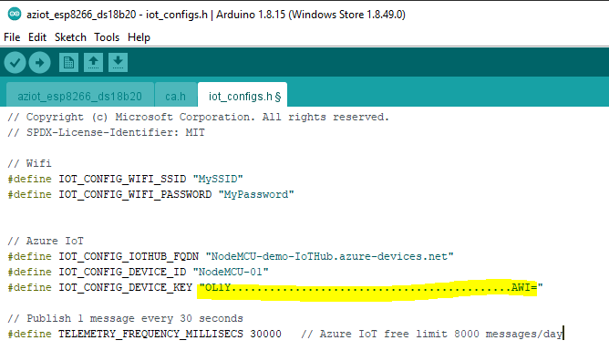
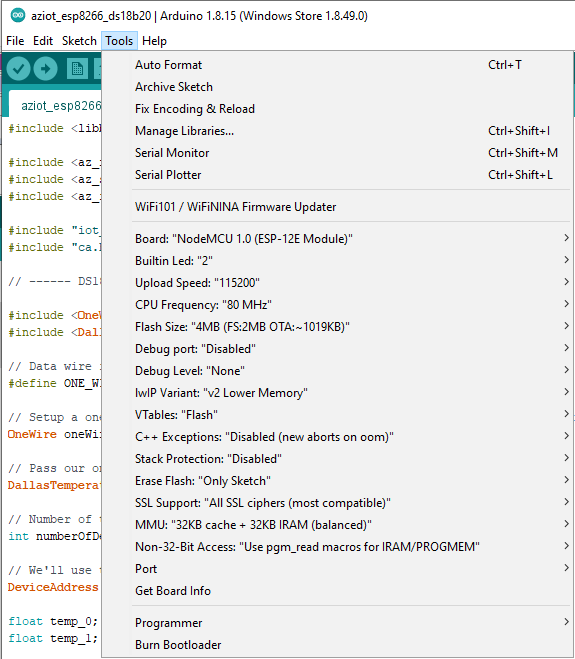

# Azure IoT with ESP8266 and temperature sensors DS18B20
This project has been build on top of the template sketch provided by Microsoft with a small customization enabling additional features measuring the temperature by using DS18B20 sensors.   

## Bill of materials
- NodeMCU
- 2xDS18B20
- Azure Subscription
- Resistor 4.7k

## Wiring

Remember that NodeMCU pins are numbered differently than internal GPIO notations of ESP8266. The D2 pin on NodeMCU used for one-wire bus communicating with DS18B20 sensors is mapped to the internal GPIO pin 4 of ESP8266.

| NodeMCU PIN      | GPIO | DS18B20 | Description |
| ----------- | ----------- | -----|-----|
| D2      | GPIO4       |  Data | 1-wire bus |
| 3V   | -        | VDD | Positive voltage 3.3V |
| G | - | GND | Ground |


## Setup and Run Instructions

### Install Arduino libraries
- Run [New-ArduinoZipLibrary.ps1](files/New-ArduinoZipLibrary.ps1) to generate zipped Arduino library for the Azure SDK for Embedded C.
- Or you may use one stored in the [azure-sdk-for-c.zip](files/azure-sdk-for-c.zip) file and import it into Arduino IDE. On the Arduino IDE, go to Sketch, Include Library, Add .ZIP Library....
- Install other libraries needed for temperature measurement. 
  - DallasTemperature by Miles Burton
  - OneWire by Paul Stoffregen

### Generate CA certificate
- Generate ca.h header with the public root CA for server certificate validation by running [New-TrustedCertHeader.ps1](files/New-TrustedCertHeader.ps1).
- Or you may use the prepared one [ca.h](ca.h) stored in this repository. It combines both BaltimoreCyberTrustRoot and DigiCert Global G2 CA as Microsoft has decided to switch from Baltimore CyberTrust CA Root to the DigiCert Global G2 CA root starting in June 2022. More information can be found [here](
https://techcommunity.microsoft.com/t5/internet-of-things/azure-iot-tls-critical-changes-are-almost-here-and-why-you/ba-p/2393169).

### Update communication parameters

The connection parameters in iot_configs.h needs to be updated before ESP8266 tries to connect to IoT Hub. 
First, paste your Wifi credentials there. 
- IOT_CONFIG_WIFI_SSID
- IOT_CONFIG_WIFI_PASSWORD

Second, IoT Hub name, device name and key to secure the communication between them.
- IOT_CONFIG_IOTHUB_FQDN - Use the Hostname from the IoT Hub overview pane.
- IOT_CONFIG_DEVICE_ID - Use the Device ID from device details.
- IOT_CONFIG_DEVICE_KEY - Use the primary key from device details.

Last, configure the interval how often to send the messages to the IoT Hub. 
- TELEMETRY_FREQUENCY_MILLISECS - Lower the number of messages per day so as not to exceed the free limit of 8000/day.





### Upload the code
In my case I'm using the NodeMCU model equipped with CH340. Further instruction on how to install the driver are in the folder [CH340](../CH340/Readme.md). 
The board needs to be set to "NodeMcu 1.0(ESP-12E Module)" and upload speed 115200.
Check the settings out from the picture and upload the code.




### Communication with IoT Hub - additional information
If you need for whatever reason to get a deeper knowledge of what happens under the hood then follow the original instructions on the Azure [github](https://github.com/Azure/azure-sdk-for-c/tree/main/sdk/samples/iot/aziot_esp8266) published by Microsoft to make the communication between IoT device and ioT hub work.
However, bear in mind these instructions do not contain information on how to put the thermometer in operation.

## Testing & Troubleshooting
Use Serial monitor to check the status of the device 

```
10:45:38.101 -> Connecting to WIFI SSID Germanium-2.4G
10:45:38.611 -> .......WiFi connected, IP address: 172.31.1.168
10:45:42.350 -> Setting time using SNTP.done!
10:45:42.861 -> Current time: Fri Sep  3 03:45:42 2021
10:45:42.861 -> Client ID: NodeMCU-01
10:45:42.861 -> Username: NodeMCU-demo-IoTHub.azure-devices.net/NodeMCU-01/?api-version=2020-09-30&DeviceClientType=c%2F1.2.0-beta.2
10:45:42.861 -> MQTT connecting ... connected.
10:45:45.858 -> Locating devices...Found 2 devices.
10:45:45.858 -> Found device 0 with address: 281256242F190197
10:45:45.904 -> Found device 1 with address: 2889B43939200126
10:45:46.650 -> Temperature for device: 0
10:45:46.650 -> Temp C: 25.06 Temp F: 77.11
10:45:46.696 -> Temperature for device: 1
10:45:46.696 -> Temp C: 25.75 Temp F: 78.35
10:45:51.688 -> 13797 ESP8266 Sending telemetry . . . OK
10:46:22.888 -> Temperature for device: 0
10:46:22.888 -> Temp C: 25.06 Temp F: 77.11
10:46:22.934 -> Temperature for device: 1
10:46:22.934 -> Temp C: 25.69 Temp F: 78.24
10:46:27.978 -> 50050 ESP8266 Sending telemetry . . . OK
```

The device telemetry and messages sent to an IoT Hub van be monitored by az cli. Current temperature is carried in the payload section.   

```
PS C:\ESP8266\Azure\aziot_esp8266> az iot hub monitor-events --hub-name "NodeMCU-demo-IoTHub" --device-id "NodeMCU-01"
Starting event monitor, filtering on device: NodeMCU-01, use ctrl-c to stop...
{
    "event": {
        "origin": "NodeMCU-01",
        "module": "",
        "interface": "",
        "component": "",
        "payload": "{ "temp_0": "25.06", "temp_1": 25.69 }"
    }
}
```


