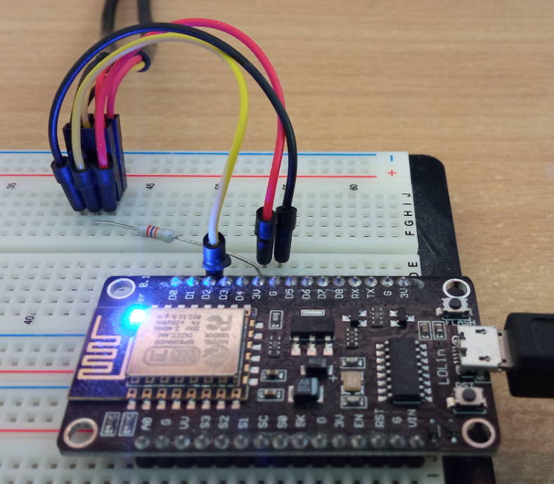

# Azure IoT with ESP8266 and temperature sensors DS18B20

### Wiring

Remember that NodeMCU pins are numbered differently than internal GPIO notations of ESP8266. The D2 pin on NodeMCU used for one-wire bus communicating with DS18B20 sensors is mapped to the internal GPIO pin 4 of ESP8266.

| NodeeMCU PIN      | GPIO | DS18B20 | Description |
| ----------- | ----------- | -----|-----|
| D2      | GPIO4       |  Data | 1-wire bus |
| 3V   | -        | VDD | Positive voltage 3.3V |
| G | - | GND | Ground |

