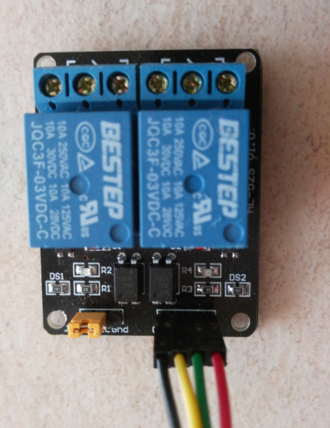
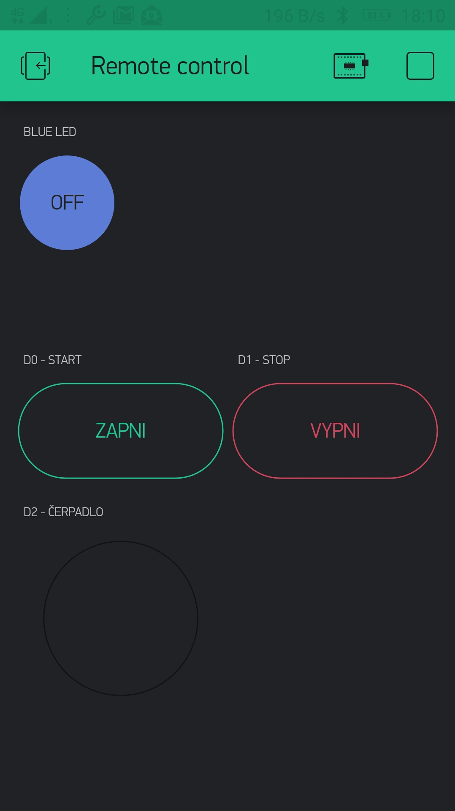
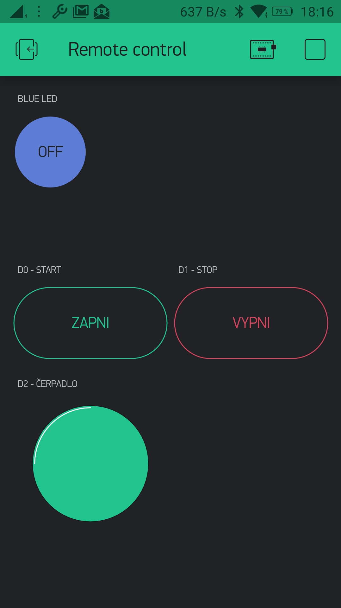

# Blynk controlled push buttons

## Description
It uses ESP8266 NodeMCU and 2-channel relay module programmed through Arduino IDE.
The relay module is connected to pins DO and D1 which are set to low state when MCU boots up. Theirs tate is changed to high when the respective button is pressed in Blynk.
The project also includes the LED widged indicating the status of remotely controlled device through the pin D2. The input signal on D2 is changed by pressing the push button to simulate the function. That may be replaced with a sensor used in a real project.

### Pinout diagram
- D0 - Output - Turn ON
- D1 - Output - Turn OFF
- D2 - Input - Status probe

### Photo
&nbsp;&nbsp;&nbsp;

## Blynk project
The blue circle shaped button in top left corner controls the blue on-board LED. It may be used for testing purpose.
The LED widget is represented with green circle in left bottom corner showing the status of D2.

&nbsp;&nbsp;&nbsp;&nbsp;

